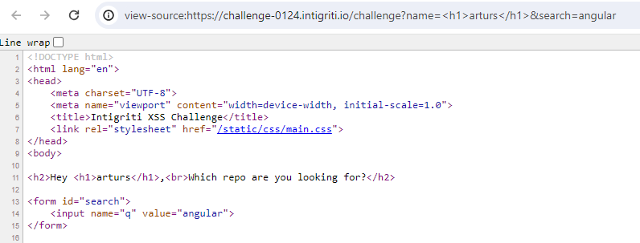
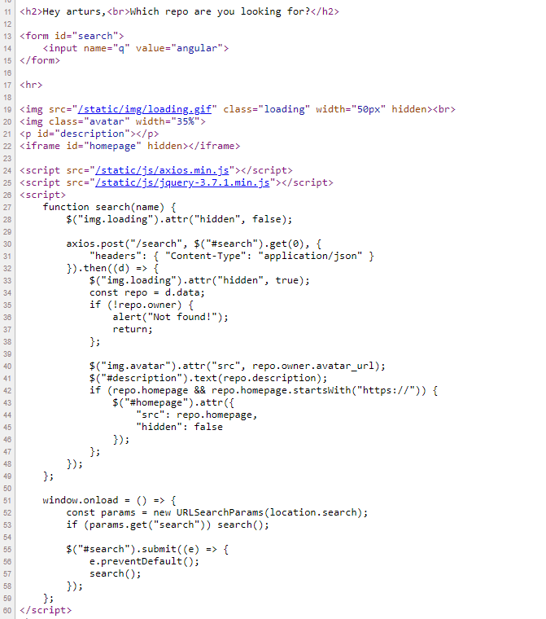
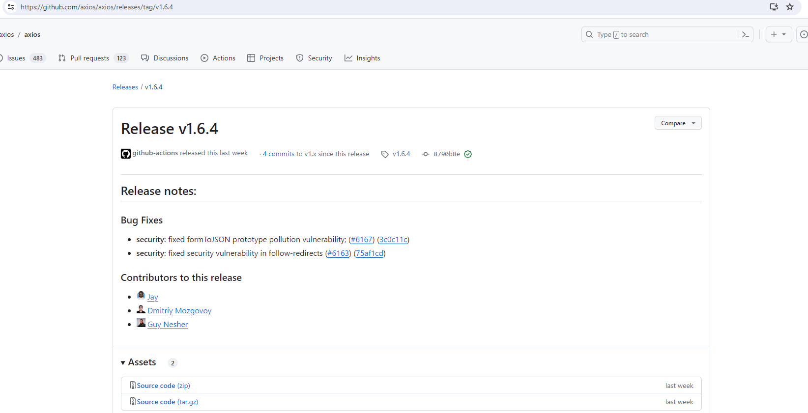
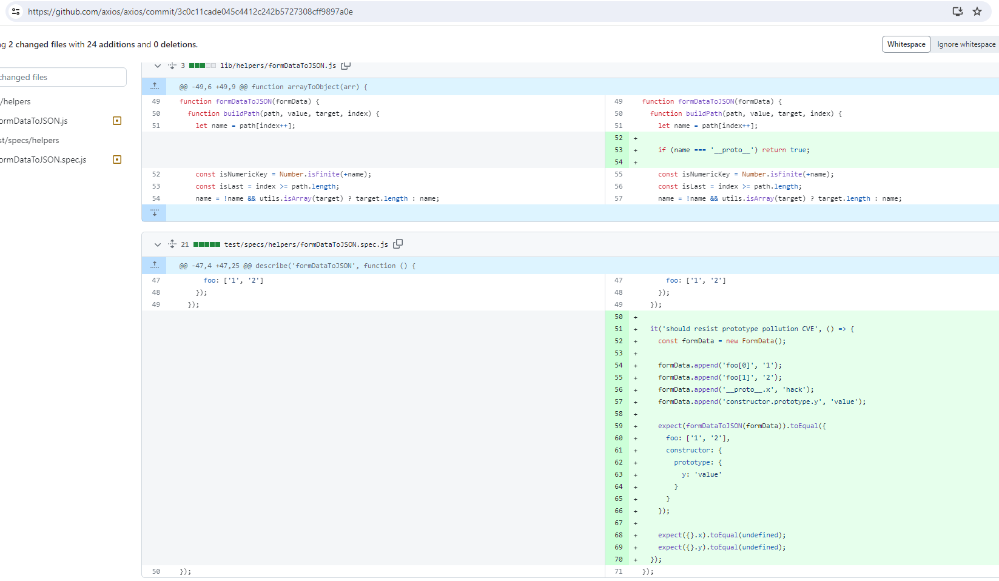
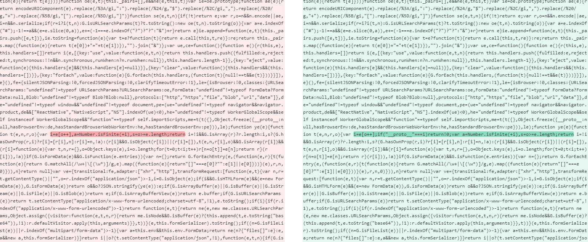
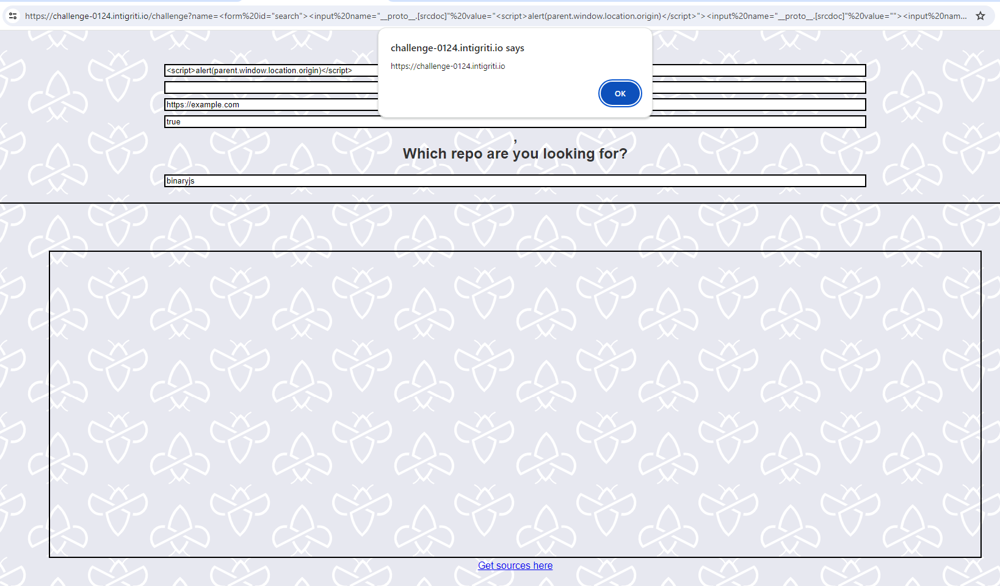

# Prototype Pollution Leading to XSS Exploitation: Intigriti's January Challenge

## Overview

Intigriti's January XSS challenge presented an interesting case involving prototype pollution leading to XSS exploitation. The following steps detail the discovery, analysis, and exploitation of the vulnerability in the provided web application.

### Step 1: Initial Inspection

Upon initial inspection, it was observed that certain parameters, particularly the `name` parameter, were susceptible to XSS attacks. Attempts to inject HTML code into the `name` parameter revealed that the HTML was rendered on the page. However, further scrutiny revealed that the server had implemented sensitization measures, preventing direct XSS exploitation through the `name` parameter.



### Step 2: Checking Packages

Analysis of the `package.json` file indicated recent updates to the packages used in the application. Despite this, upon inspecting the source code, it was identified that the Axios and jQuery libraries were loaded from external JavaScript files.



### Step 3: Outdated Package

Further investigation revealed that the Axios package had undergone recent updates. Given that the `$("search")` form element, passed to Axios, was susceptible to prototype pollution, an attempt to exploit this vulnerability was initiated. A comparison of the source code between the application's Axios version and the latest Axios version exposed differences directly related to prototype pollution.

<div>
    
</div>

<div>
    
</div>

<div>
    
</div>

### Step 4: Crafting Payload

By injecting a `<form>` with the id "search," it was observed that Axios was sending form data to the server. Prototype pollution was exploited by injecting a malicious payload into the form data. Initially, the payload manipulation was constrained to cases where the server returned an empty array due to no results. However, a closer examination revealed that manipulation of the payload values, undergoing jQuery sanitization, allowed the injection of XSS using the `srcdoc` attribute of an iframe element.

**Final Payload on `name` Parameter:**

```html
<form id="search">
    <input name="__proto__.[srcdoc]" value="<script>alert(parent.window.location.origin)</script>">
    <input name="__proto__.[srcdoc]" value="">
    <input name="__proto__.homepage" value="https://example.com">
    <input name="__proto__.owner.avatar_url" value="true">
</form>
```

https://challenge-0124.intigriti.io/challenge?name=%3Cform%20id=%22search%22%3E%3Cinput%20name=%22__proto__.[srcdoc]%22%20value=%22%3Cscript%3Ealert(parent.window.location.origin)%3C/script%3E%22%3E%3Cinput%20name=%22__proto__.[srcdoc]%22%20value=%22%22%3E%3Cinput%20name=%22__proto__.homepage%22%20value=%22https://example.com%22%3E%3Cinput%20name=%22__proto__.owner.avatar_url%22%20value=%22true%22%3E%3C/form%3E&search=binaryjs

### Step 5: XSS Exploitation

The crafted payload successfully exploited the XSS vulnerability, triggering the execution of a script and demonstrating the impact of prototype pollution on the application.



This comprehensive analysis showcases the identification and exploitation of prototype pollution leading to XSS, emphasizing the significance of keeping packages up-to-date and addressing vulnerabilities in web applications.

#### References

* https://challenge-0124.intigriti.io/
* https://challenge-0124.intigriti.io/challenge
* https://github.com/arturssmirnovs/challenge-0124.intigriti.io-january-xss-challenge
